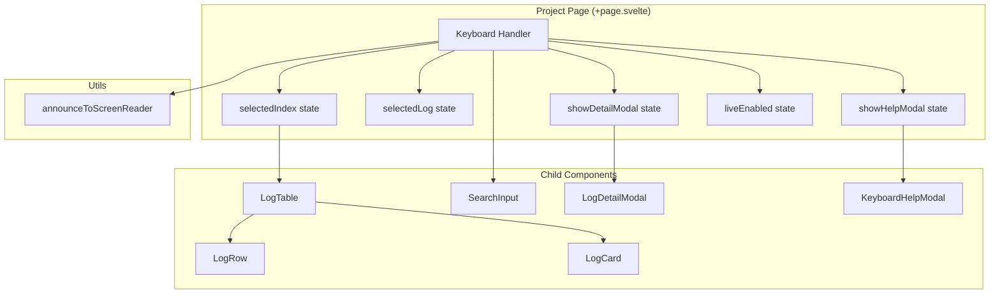
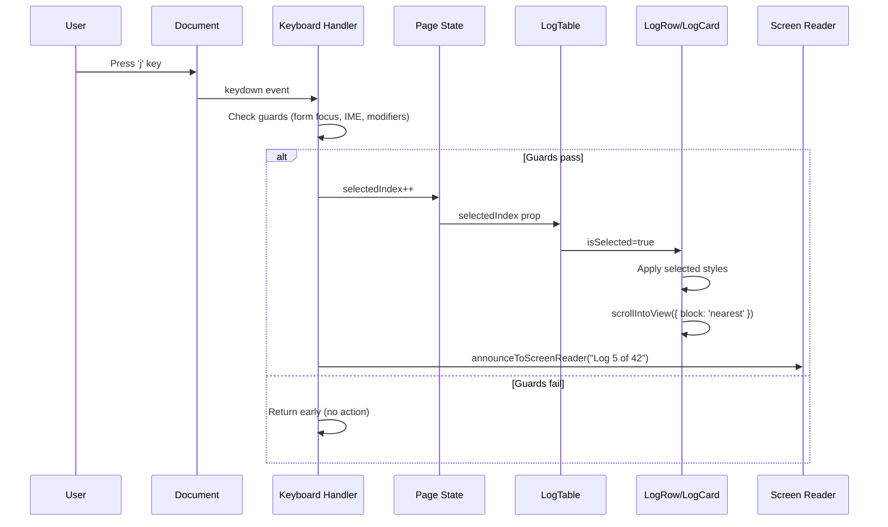
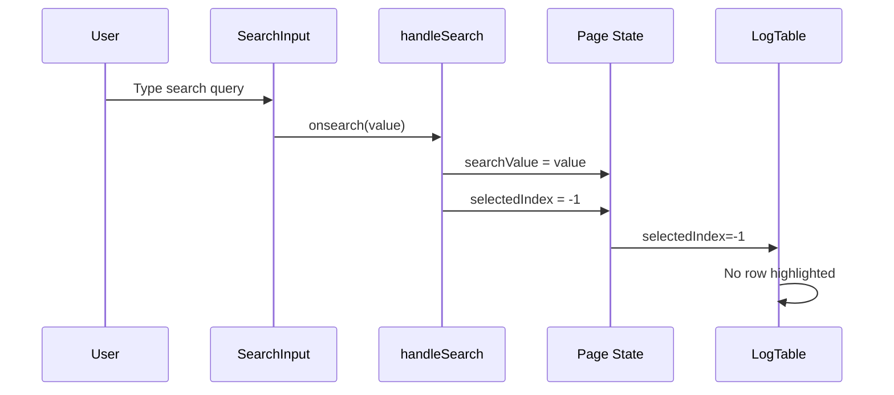
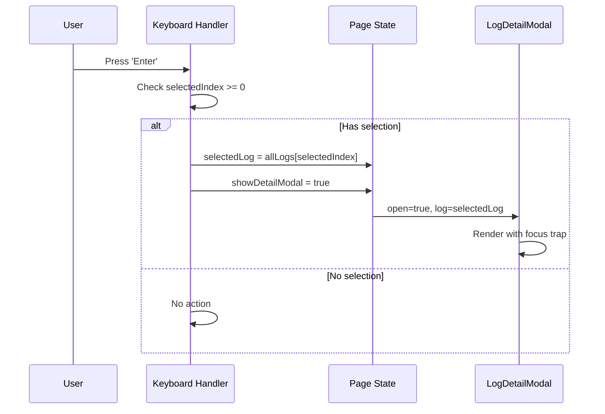

# Design: Keyboard Shortcuts for Log Viewer

## Design Inputs

From the design interview:
- **Architecture style**: Extend existing patterns (`svelte:document` handler at page level)
- **Technology constraints**: None - use whatever fits best

## Overview

Implement keyboard shortcuts for power users to navigate and interact with the log viewer without a mouse. The design leverages the existing `<svelte:document onkeydown>` pattern already used by modals in the codebase. A single keyboard handler at the page level manages all shortcuts, with state for `selectedIndex` tracking the currently selected log. Selection state flows down to LogTable/LogRow/LogCard components for visual highlighting.

## Architecture



## Components

### Keyboard Handler (Page Level)

**Purpose**: Central handler for all keyboard shortcuts on the log viewer page.

**Responsibilities**:
- Listen for keydown events via `<svelte:document>`
- Guard against form field focus (INPUT/TEXTAREA/SELECT)
- Guard against IME composition (`event.isComposing`)
- Guard against modifier keys (Ctrl, Alt, Meta) for single-key shortcuts
- Dispatch to appropriate action based on key pressed
- Manage selection state (`selectedIndex`)

**Interfaces**:
```typescript
interface KeyboardShortcut {
  key: string;
  description: string;
  action: () => void;
  /** Guard against modal open state */
  requiresNoModal?: boolean;
}

/** Form elements that should block shortcuts */
const FORM_ELEMENTS = ['INPUT', 'TEXTAREA', 'SELECT'] as const;

/** Check if shortcuts should be blocked */
function shouldBlockShortcut(event: KeyboardEvent): boolean {
  const target = event.target as HTMLElement;
  if (FORM_ELEMENTS.includes(target.tagName as typeof FORM_ELEMENTS[number])) {
    return true;
  }
  if (event.isComposing) {
    return true;
  }
  if (event.ctrlKey || event.altKey || event.metaKey) {
    return true;
  }
  return false;
}
```

### LogTable Component

**Purpose**: Container for log rows (desktop) and log cards (mobile).

**Responsibilities**:
- Accept `selectedIndex` prop to indicate which log is selected
- Pass selection state to child LogRow/LogCard components
- Provide data attribute for selected row/card for scrollIntoView

**Interface Changes**:
```typescript
interface Props {
  logs: Log[];
  loading?: boolean;
  hasFilters?: boolean;
  onLogClick?: (log: Log) => void;
  class?: string;
  newLogIds?: Set<string>;
  project?: { apiKey: string };
  appUrl?: string;
  /** NEW: Index of keyboard-selected log (-1 = none) */
  selectedIndex?: number;
}
```

### LogRow Component

**Purpose**: Single log entry in table view (desktop).

**Responsibilities**:
- Accept `isSelected` prop for visual highlighting
- Apply distinct selected style (different from hover)
- Add data attribute for scroll targeting

**Interface Changes**:
```typescript
interface Props {
  log: Log;
  onclick?: (log: Log) => void;
  class?: string;
  isNew?: boolean;
  /** NEW: Whether this row is keyboard-selected */
  isSelected?: boolean;
}
```

### LogCard Component

**Purpose**: Single log entry in card view (mobile).

**Responsibilities**:
- Accept `isSelected` prop for visual highlighting
- Apply distinct selected style
- Add data attribute for scroll targeting

**Interface Changes**:
```typescript
interface Props {
  log: Log;
  onclick?: (log: Log) => void;
  class?: string;
  isNew?: boolean;
  /** NEW: Whether this card is keyboard-selected */
  isSelected?: boolean;
}
```

### SearchInput Component

**Purpose**: Search input with debounced filtering.

**Responsibilities**:
- Expose input element ref for programmatic focus
- Handle Escape key to blur and signal focus return

**Interface Changes**:
```typescript
interface Props {
  value?: string;
  placeholder?: string;
  disabled?: boolean;
  onsearch?: (value: string) => void;
  /** NEW: Ref to the underlying input element */
  ref?: HTMLInputElement | null;
  /** NEW: Callback when Escape pressed while focused */
  onEscape?: () => void;
}
```

### KeyboardHelpModal Component (NEW)

**Purpose**: Display available keyboard shortcuts in a modal dialog.

**Responsibilities**:
- List all shortcuts with their descriptions
- Handle Escape to close
- Focus trap for accessibility

**Interfaces**:
```typescript
interface Props {
  open: boolean;
  onClose: () => void;
}

interface ShortcutGroup {
  title: string;
  shortcuts: Array<{
    key: string;
    description: string;
  }>;
}
```

## Data Flow



### Filter Change Reset Flow



### Modal Open Flow



## Technical Decisions

| Decision | Options Considered | Choice | Rationale |
|----------|-------------------|--------|-----------|
| Keyboard event location | Component-level handlers, Page-level handler | Page-level `<svelte:document>` | Matches existing modal pattern; single source of truth; avoids prop drilling callbacks |
| Selection state storage | Store, Context, Page state | Page-level `$state` | Selection is page-specific; no need for global access; simpler than store |
| Scroll behavior | instant, smooth, auto | `{ block: 'nearest', behavior: 'smooth' }` | Nearest prevents unnecessary scrolling; smooth provides visual feedback |
| Help modal component | Inline in page, Separate component | Separate component | Reusable pattern; matches existing modal structure; cleaner page code |
| Form field guard check | Event delegation check, Target tagName | `event.target.tagName` | Simple, reliable; matches research best practices |
| Selection reset trigger | `$effect` watching filters, Explicit in handlers | Explicit in filter handlers | More predictable; avoids circular reactivity; clearer intent |
| Selected style | Ring, Background, Border | Background + ring outline | Visible on both light/dark themes; distinct from hover; accessible |

## File Structure

| File | Action | Purpose |
|------|--------|---------|
| `src/routes/(app)/projects/[id]/+page.svelte` | Modify | Add keyboard handler, selectedIndex state, help modal toggle, filter reset logic |
| `src/lib/components/log-table.svelte` | Modify | Accept selectedIndex prop, pass isSelected to children |
| `src/lib/components/log-row.svelte` | Modify | Accept isSelected prop, add selected styles, add data attribute |
| `src/lib/components/log-card.svelte` | Modify | Accept isSelected prop, add selected styles, add data attribute |
| `src/lib/components/search-input.svelte` | Modify | Expose ref bindable, add onEscape callback |
| `src/lib/components/keyboard-help-modal.svelte` | Create | New modal component for shortcut help |
| `src/lib/utils/keyboard.ts` | Create | Keyboard guard utilities and shortcut definitions |

## Error Handling

| Error Scenario | Handling Strategy | User Impact |
|----------------|-------------------|-------------|
| Empty log list | Guard: if logs.length === 0, j/k do nothing | No visual change; no error |
| selectedIndex out of bounds | Clamp to valid range [0, logs.length-1] | Selection stays at boundary |
| Modal already open | Guard: j/k/l disabled when any modal open | Modal behavior unchanged |
| Focus in search input | Guard: shortcuts disabled (except Esc) | User can type normally |
| IME composition active | Guard: `event.isComposing` check | International keyboard users unaffected |
| Modifier key pressed | Guard: skip if Ctrl/Alt/Meta held | Browser shortcuts work normally |
| Search input ref null | Null-safe access: `searchRef?.focus()` | No crash; shortcut silently fails |

## Edge Cases

- **Live streaming adds logs**: New logs prepend to array. `selectedIndex` still points to same absolute position, which is now a different log. This is acceptable - Gmail behaves similarly.
- **Sorting changes order**: When user sorts by column, `sortedLogs` derived array changes order. `selectedIndex` should track position in sorted array, not original. Pass `selectedIndex` to LogTable which uses `sortedLogs`.
- **Filter removes selected log**: When filters change, reset `selectedIndex` to -1. This prevents acting on wrong log.
- **Very fast key repeat**: Browser's native key repeat handles this. No debouncing needed - each keypress increments/decrements index.
- **Mobile with external keyboard**: Same shortcuts work. LogCard gets same `isSelected` treatment as LogRow.
- **Screen zoom/resize**: `scrollIntoView` handles positioning correctly regardless of zoom level.
- **Multiple modals open**: Should not happen - page controls modal state. If help modal open, log detail cannot also open.

## Test Strategy

### Unit Tests (`src/lib/utils/keyboard.test.ts`)

**Coverage target: 100%**

- `shouldBlockShortcut`:
  - Returns true when target is INPUT element
  - Returns true when target is TEXTAREA element
  - Returns true when target is SELECT element
  - Returns true when event.isComposing is true
  - Returns true when ctrlKey is pressed
  - Returns true when altKey is pressed
  - Returns true when metaKey is pressed
  - Returns false for regular DIV target
  - Returns false for TABLE target

### Component Tests

**LogRow (`src/lib/components/log-row.test.ts`)**
- Renders without isSelected prop (default false)
- Applies selected class when isSelected=true
- Does not apply selected class when isSelected=false
- Has data-testid="log-row-selected" when selected

**LogCard (`src/lib/components/log-card.test.ts`)**
- Renders without isSelected prop (default false)
- Applies selected class when isSelected=true
- Has data-testid="log-card-selected" when selected

**LogTable (`src/lib/components/log-table.test.ts`)**
- Passes selectedIndex to LogRow components
- Passes selectedIndex to LogCard components
- Calculates isSelected correctly based on index

**SearchInput (`src/lib/components/search-input.test.ts`)**
- Exposes ref bindable prop
- Calls onEscape when Escape pressed while focused
- Does not call onEscape when other keys pressed

**KeyboardHelpModal (`src/lib/components/keyboard-help-modal.test.ts`)**
- Renders when open=true
- Does not render when open=false
- Displays all shortcuts
- Calls onClose when Escape pressed
- Has proper focus trap

### Integration Tests

**Keyboard navigation (`src/routes/(app)/projects/[id]/+page.test.ts`)**
- j key selects first log when nothing selected
- j key moves selection down
- k key moves selection up
- j key stops at last log (no wrap)
- k key stops at first log (no wrap)
- Enter opens detail modal for selected log
- Enter does nothing when no selection
- Escape closes detail modal
- Selection preserved after modal close
- / key focuses search input
- Escape in search blurs input
- l key toggles liveEnabled
- ? key opens help modal
- Shortcuts disabled when typing in search
- Selection resets on search change
- Selection resets on level filter change
- Selection resets on time range change

### E2E Tests (`tests/keyboard-shortcuts.spec.ts`)

**Full keyboard workflow**
- User can navigate entire log list with j/k
- User can open and close log details with Enter/Escape
- User can search with / and return with Escape
- User can toggle live mode with l
- User can view help with ? and close with Escape
- All shortcuts work after filter changes

## Performance Considerations

- **No DOM traversal for navigation**: `selectedIndex` is a simple number. Finding selected log is O(1) array access.
- **Single keydown listener**: One `<svelte:document>` handler, not one per row. Scales to thousands of logs.
- **scrollIntoView is native**: Browser-optimized; no JavaScript scroll calculation.
- **Derived state is cached**: `$derived` arrays like `sortedLogs` only recalculate when dependencies change.
- **Event handler is synchronous**: No async operations in keydown handler. Response within single frame (< 16ms).

## Security Considerations

- **No user input executed**: Keyboard shortcuts only modify local state. No data sent to server.
- **No eval or dynamic code**: Shortcut actions are static function calls, not evaluated strings.
- **Modal XSS prevention**: Help modal content is static; no user-provided data displayed.

## Accessibility Considerations

- **Screen reader announcements**: Use existing `announceToScreenReader` to announce "Log X of Y" on navigation.
- **Focus management**: When modal opens, focus trapped inside. When modal closes, focus returns to previously focused element (existing behavior).
- **Keyboard-only workflow**: All functionality accessible without mouse.
- **Help discoverability**: ? key matches established convention (Gmail, GitHub, YouTube).
- **ARIA labels**: Selected log row/card has `aria-selected="true"` attribute.

## Existing Patterns to Follow

Based on codebase analysis:
- **Event handling**: Use `<svelte:document onkeydown={handler}>` pattern (from log-detail-modal.svelte)
- **State management**: Use `$state` and `$derived` runes (Svelte 5 style throughout codebase)
- **Component props**: Use `$props()` with TypeScript interfaces (consistent pattern)
- **Bindable props**: Use `$bindable()` for two-way binding (see Input component `ref`)
- **Modal structure**: Follow log-detail-modal.svelte for new KeyboardHelpModal
- **Styling**: Use `cn()` utility for conditional classes, Tailwind for styles
- **Accessibility**: Use existing `announceToScreenReader` and `focusTrap` utilities
- **Testing**: Use @testing-library/svelte for component tests, Playwright for E2E
