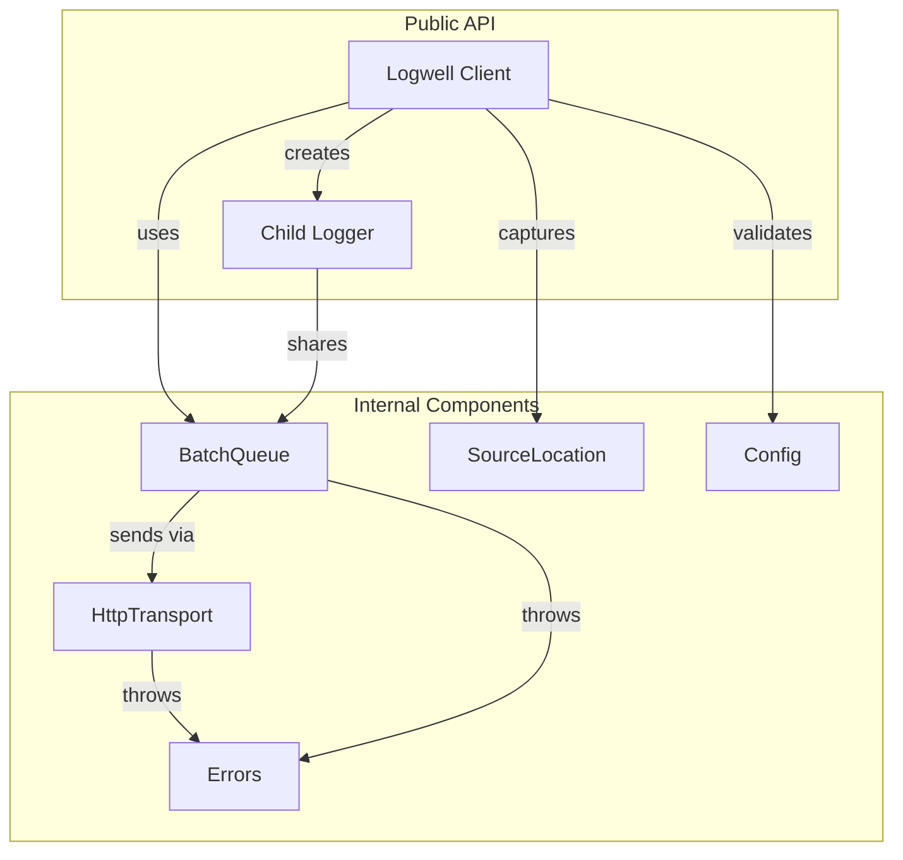

# Design: Python SDK

## Overview

Port of TypeScript SDK to Python. Mirrors module structure, class design, and API surface. Uses httpx for async HTTP, threading for timer-based flush, and inspect for source location.

## Architecture



## Components

### Logwell (client.py)

**Purpose**: Main entry point. Exposes all logging methods.

**Responsibilities**:
- Validate and store config
- Create transport and queue
- Route log calls to queue
- Capture source location when enabled
- Create child loggers

**API**:
```python
class Logwell:
    def __init__(self, config: LogwellConfig) -> None

    @property
    def queue_size(self) -> int

    def debug(self, message: str, metadata: dict | None = None) -> None
    def info(self, message: str, metadata: dict | None = None) -> None
    def warn(self, message: str, metadata: dict | None = None) -> None
    def error(self, message: str, metadata: dict | None = None) -> None
    def fatal(self, message: str, metadata: dict | None = None) -> None
    def log(self, entry: LogEntry) -> None

    async def flush(self) -> IngestResponse | None
    async def shutdown(self) -> None

    def child(self, *, service: str | None = None,
              metadata: dict | None = None) -> Logwell
```

### BatchQueue (queue.py)

**Purpose**: Buffer logs and manage auto-flush.

**Responsibilities**:
- Store logs in thread-safe list
- Trigger flush on batch_size threshold
- Manage flush timer via threading.Timer
- Handle overflow by dropping oldest
- Re-queue failed batches
- Prevent concurrent flushes

**API**:
```python
class BatchQueue:
    def __init__(self, send_batch: SendBatchFn, config: QueueConfig) -> None

    @property
    def size(self) -> int

    def add(self, entry: LogEntry) -> None
    async def flush(self) -> IngestResponse | None
    async def shutdown(self) -> None
```

### HttpTransport (transport.py)

**Purpose**: Send HTTP requests with retry logic.

**Responsibilities**:
- POST to `/v1/ingest` endpoint
- Add Authorization header
- Retry with exponential backoff + jitter
- Classify errors by HTTP status
- Set retryable flag appropriately

**API**:
```python
class HttpTransport:
    def __init__(self, config: TransportConfig) -> None
    async def send(self, logs: list[LogEntry]) -> IngestResponse
```

### SourceLocation (source_location.py)

**Purpose**: Capture caller file/line info.

**Responsibilities**:
- Use `inspect.stack()` to get call frames
- Skip internal SDK frames
- Return file path and line number

**API**:
```python
@dataclass
class SourceLocation:
    source_file: str
    line_number: int

def capture_source_location(skip_frames: int = 0) -> SourceLocation | None
```

### Config (config.py)

**Purpose**: Validate and merge config with defaults.

**Responsibilities**:
- Validate API key format with regex
- Validate endpoint as URL
- Validate numeric bounds
- Merge with DEFAULT_CONFIG

**API**:
```python
DEFAULT_CONFIG: dict[str, Any]
API_KEY_REGEX: re.Pattern

def validate_api_key_format(api_key: str) -> bool
def validate_config(config: LogwellConfig) -> LogwellConfig
```

### Errors (errors.py)

**Purpose**: Custom exception with error codes.

**API**:
```python
class LogwellErrorCode(str, Enum):
    NETWORK_ERROR = "NETWORK_ERROR"
    UNAUTHORIZED = "UNAUTHORIZED"
    VALIDATION_ERROR = "VALIDATION_ERROR"
    RATE_LIMITED = "RATE_LIMITED"
    SERVER_ERROR = "SERVER_ERROR"
    QUEUE_OVERFLOW = "QUEUE_OVERFLOW"
    INVALID_CONFIG = "INVALID_CONFIG"

class LogwellError(Exception):
    def __init__(self, message: str, code: LogwellErrorCode,
                 status_code: int | None = None, retryable: bool = False)
```

### Types (types.py)

**Purpose**: Type definitions.

**API**:
```python
LogLevel = Literal["debug", "info", "warn", "error", "fatal"]

class LogEntry(TypedDict, total=False):
    level: Required[LogLevel]
    message: Required[str]
    timestamp: str
    service: str
    metadata: dict[str, Any]
    source_file: str
    line_number: int

class LogwellConfig(TypedDict, total=False):
    api_key: Required[str]
    endpoint: Required[str]
    service: str
    batch_size: int
    flush_interval: float  # seconds
    max_queue_size: int
    max_retries: int
    capture_source_location: bool
    on_error: Callable[[Exception], None]
    on_flush: Callable[[int], None]

class IngestResponse(TypedDict):
    accepted: int
    rejected: NotRequired[int]
    errors: NotRequired[list[str]]
```

## Data Flow

1. User calls `logger.info("message", {"key": "value"})`
2. `Logwell._add_log()` captures source location if enabled
3. Log entry enriched with timestamp, service, merged metadata
4. `BatchQueue.add()` appends to queue
5. If `len(queue) >= batch_size`, trigger `flush()`
6. If first item, start flush timer
7. On flush: `HttpTransport.send()` POSTs to endpoint
8. On success: clear batch, call `on_flush`
9. On failure: re-queue, call `on_error`, restart timer

## Technical Decisions

| Decision | Options | Choice | Rationale |
|----------|---------|--------|-----------|
| HTTP Client | httpx, aiohttp, requests | httpx | Modern, async-native, sync support |
| Timer | threading.Timer, asyncio.create_task | threading.Timer | Works without running event loop |
| Types | TypedDict, dataclass, Pydantic | TypedDict | Zero runtime overhead |
| Packaging | setuptools, poetry, flit | pyproject.toml (hatch) | PEP 517/518 compliant |
| Linting | flake8+black, ruff | ruff | Fast, all-in-one |
| Testing | pytest, unittest | pytest | Industry standard |

## File Structure

| File | Action | Purpose |
|------|--------|---------|
| `sdks/python/pyproject.toml` | Create | Package metadata, deps |
| `sdks/python/README.md` | Create | Usage docs |
| `sdks/python/LICENSE` | Create | MIT license |
| `sdks/python/src/logwell/__init__.py` | Create | Public exports |
| `sdks/python/src/logwell/client.py` | Create | Logwell class |
| `sdks/python/src/logwell/types.py` | Create | TypedDict definitions |
| `sdks/python/src/logwell/config.py` | Create | Validation, defaults |
| `sdks/python/src/logwell/errors.py` | Create | LogwellError class |
| `sdks/python/src/logwell/queue.py` | Create | BatchQueue class |
| `sdks/python/src/logwell/transport.py` | Create | HttpTransport class |
| `sdks/python/src/logwell/source_location.py` | Create | Source capture |
| `sdks/python/tests/__init__.py` | Create | Test package |
| `sdks/python/tests/conftest.py` | Create | Pytest fixtures |
| `sdks/python/tests/unit/test_client.py` | Create | Client unit tests |
| `sdks/python/tests/unit/test_config.py` | Create | Config unit tests |
| `sdks/python/tests/unit/test_errors.py` | Create | Error unit tests |
| `sdks/python/tests/unit/test_queue.py` | Create | Queue unit tests |
| `sdks/python/tests/unit/test_source_location.py` | Create | Source loc tests |
| `sdks/python/tests/integration/test_e2e.py` | Create | E2E tests |

## Error Handling

| Error | Handling | User Impact |
|-------|----------|-------------|
| Invalid API key format | Raise `LogwellError(INVALID_CONFIG)` at init | Clear error message |
| Invalid endpoint URL | Raise `LogwellError(INVALID_CONFIG)` at init | Clear error message |
| Network failure | Retry with backoff, then raise/callback | Logs re-queued |
| 401 Unauthorized | No retry, raise immediately | `on_error` callback |
| 429 Rate Limited | Retry with backoff | Transparent to user |
| 5xx Server Error | Retry with backoff | Transparent to user |
| Queue overflow | Drop oldest, call `on_error` | Partial data loss |

## Thread Safety

```python
class BatchQueue:
    def __init__(self, ...):
        self._queue: list[LogEntry] = []
        self._lock = threading.Lock()
        self._timer: threading.Timer | None = None
        self._flushing = False
        self._stopped = False

    def add(self, entry: LogEntry) -> None:
        with self._lock:
            if self._stopped:
                return
            # Handle overflow, append, maybe trigger flush
```

## Async/Sync Pattern

```python
# Internal async implementation
async def _flush_async(self) -> IngestResponse | None:
    ...

# Public async method
async def flush(self) -> IngestResponse | None:
    return await self._flush_async()

# For sync contexts, use asyncio.run() or similar
def flush_sync(self) -> IngestResponse | None:
    return asyncio.get_event_loop().run_until_complete(self._flush_async())
```

## Existing Patterns to Follow

- TypeScript SDK module structure: `sdks/typescript/src/`
- Test organization: `tests/unit/`, `tests/integration/`
- Config defaults pattern: `sdks/typescript/src/config.ts:7-13`
- Queue re-queue on failure: `sdks/typescript/src/queue.ts:112-113`
- Exponential backoff: `sdks/typescript/src/transport.ts:17-21`
